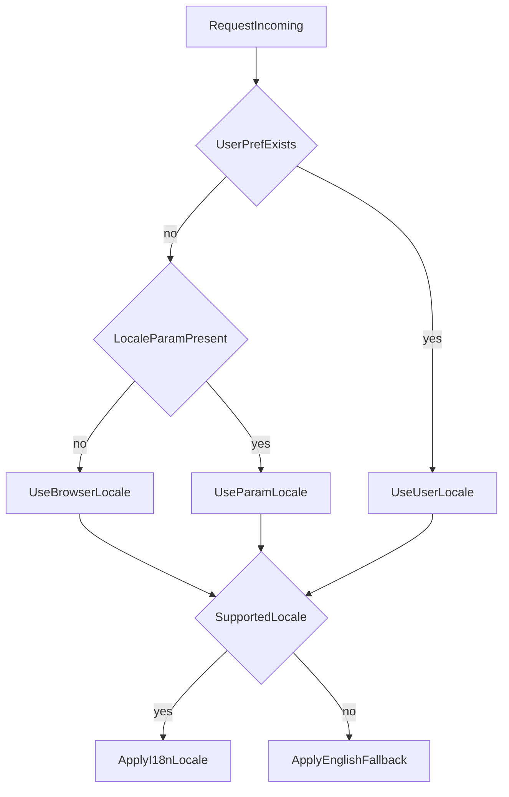

# I18n Locale Resolution Flow

This document defines how the web app should choose a locale for each request.

## Goals

- Support `en`, `fr`, and `es`.
- Respect a user-selected language when available.
- Fall back to browser preference for first-time users.
- Use English as the final fallback.

## Resolution Order

1. User saved preference (persisted on the user account).
2. Explicit locale parameter in the request.
3. Browser locale from `Accept-Language`.
4. Default fallback locale: `en`.

Only supported locales (`en`, `fr`, `es`) are applied. Any unsupported value falls back to `en`.

## Flow Diagram

## Naming Constraints

- Keep `Backdoor` in English.
- Keep third-party source names unchanged (for example: Strava, Chaster, PiShock, PuryFi).
- `Vitrine` can be translated.
- Keep the game name `Snake` unchanged (while translating surrounding UI text).
